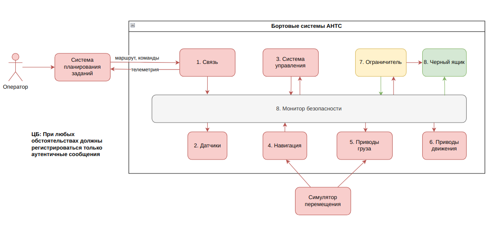
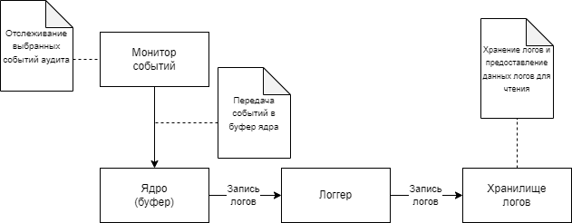

# Шаблон «Безопасная регистрация» 

## Назначение шаблона

Шаблон предназначен для организации безопасного хранения журналов событий, обеспечивая их целостность, аутентичность и доступность. В контексте модуля `BlackBox` шаблон гарантирует, что в лог сохраняются только проверенные и подписанные события, а доступ к файлу лога контролируется через отдельный буфер ядра.

## Цели безопасности
* При любых обстоятельствах должны регистрироваться только аутентичные сообщения:
    * **Целостность**: каждая запись в журнале формируется на основе проверенного события и не может быть изменена или подменена незаметно.
    * **Аутентичность**: перед записью в лог `BlackBox` проверяет цифровую подпись события с помощью `verify_event_signature`.
    * **Доступность**: модуль запускается как отдельный процесс (`BaseBlackBox.Process`), обеспечивающий непрерывное логирование при нормальной работе системы.

## Предположения безопасности

* Доверие ядру ОС: буфер событий (multiprocessing.Queue) и файловая система надёжно обеспечивают изоляцию и целостность буфера ядра и файла лога.
* Неиспользование альтернативных каналов доступа: доступ к файлу `blackbox.log` ограничен только элементом `BlackBox`.
* Предполагается защищённость ключей: приватный и публичный ключи хранятся в безопасном хранилище вне `BlackBox`, а публичный ключ корректно инициализируется до начала работы.

# Описание решения
Элементы системы, реализующие шаблон:

* **Буфер ядра:** очередь multiprocessing.Queue (_events_q), зарегистрированная в QueuesDirectory. Используется как канал получения событий из внешних компонентов в изолированный процесс BlackBox.

* **Обработчик событий:** метод _check_events_q класса `BaseBlackBox` извлекает события из очереди и обрабатывает их в зависимости от типа операции (operation):

    * Если `operation == 'log_event'`, вызывается `_log_event` — происходит сериализация события (event.parameters) и запись в файл.

    * Если `operation == 'log_message'`, вызывается `_log_message_impl` — сообщение предварительно разбирается на подпись и содержимое, затем записывается в файл с временной меткой в JSON-формате.

* **Проверка аутентичности:** для всех входящих событий обязательно проводится проверка подписи (verify_event_signature). Только валидно подписанные события допускаются к логированию.

* **Логгер:**

    * _log_event сериализует объект события (Event) с помощью serialize() и записывает в файл `blackbox.log`.

    * _log_message_impl используется для логирования отдельных сообщений и записывает данные в том же файле, но в другом формате (JSON с ключами time, message, signature).

* **Хранилище:** файл `blackbox.log` (путь задаётся через параметр storage_path). Очищается при инициализации `BlackBox`. Доступ осуществляется только для дозаписи, с кодировкой UTF-8. Каждое событие сохраняется в формате JSON, одна запись — одна строка.

Взаимодействие элементов шаблона представлено на рисунке 1:

*Рисунок 1. Архитектура блока «Безопасная регистрация*

**Cхема взаимодействия:**
1. Внешний компонент формирует объект Event, добавляет цифровую подпись и помещает его в очередь QueuesDirectory.
2. В процессе run() экземпляра BaseBlackBox происходит регулярная проверка очереди (_check_events_q).
3. Если подпись валидна, выполняется соответствующее действие:
    `log_event` → сериализация event.parameters, запись через _log_event.
    `log_message` → разбор строки (signature message), добавление временной метки, запись через _log_message_impl.
4. Все валидные события логируются в blackbox.log в формате JSON, каждая строка — отдельная запись.

## Требования к технологии разработки элементов системы

* Наследование от `BaseBlackBox` накладывает требования к реализации абстрактных методов `_log_event` и `_log_message_impl`, как задано в базовом шаблоне «Монитор».
* Использование `multiprocessing.Queue` требует соблюдения рекомендаций по разделению потоков данных на уровне драйверов,

## Ограничения на применение шаблона

* Шаблон подходит для логирования исключительно важных событий безопасности, так как записи проходят проверку подписи и пишутся в общее хранилище.
* Если существует альтернативный доступ к файлу лога вне механизма `BlackBox`, целостность и аутентичность могут быть нарушены.
Вот сокращённый и более общий вариант раздела про тестирование:

---

## Тестирование

Для модуля `BlackBox` реализован набор модульных тестов, направленных на проверку его корректной работы и соответствия требованиям безопасности.

Проверяемые аспекты:

* **Аутентичность событий** — проверяется, что события без подписи или с недействительной подписью не сохраняются.
* **Логирование** — тестируется корректность сериализации событий и их запись в лог-файл в формате JSON.
* **Обработка очередей** — проверяется корректная работа очереди `_events_q`, включая извлечение, проверку и обработку событий.
* **Поведение при ошибках** — тестируется реакция системы на некорректные пути и попытки записи в директории.

Запуск тестов осуществляется посредством команды `python3 -m pytest -v tests/test_blackbox.py`

## Демонстрация работы решения:
Видео-демонстрация работы реализованного решения, применённого к [Кибериммунная автономность. Создание конструктивно защищённого автономного наземного транспортного средства. Модуль 4](cyberimmunity--autonomous-car-m4.ipynb) может быть найдена в [BlackBoxSample.mp4](https://disk.yandex.ru/i/DeFB6T_46ZplWA) 

---

# [ГОСТ. Защита информации. СИСТЕМЫ С КОНСТРУКТИВНОЙ ИНФОРМАЦИОННОЙ БЕЗОПАСНОСТЬ. Методология разработки](https://fstec.ru/tk-362/standarty/proekty/proekt-natsionalnogo-standarta-gost-r-6)

## А.9 Шаблон «Безопасная регистрация»
### А 9.1 Назначение шаблона. 
Шаблон предназначен для организации безопасного хранения журналов в системе, а именно, для обеспечения их целостности, аутентичности и доступности.
### А 9.2 Типовые цели безопасности. 
Типовые цели безопасности при применении шаблона: обеспечение целостности, аутентичности и доступности сообщений в журналах событий.
### А 9.3 Предположения безопасности.
Предположения безопасности включают доверие ядру операционной системы в смысле обеспечения целостности, аутентичности и доступности данных в выделенном буфере ядра.
Предположения и условия, при которых шаблон не может быть применен: альтернативный канал доступа к журналам доступа, который позволяет обходить установленные на основе реализации шаблона ограничения доступа.
### А 9.4 Описание решения.
Элементы системы, реализующей шаблон:
- элемент, реализующий монитор событий;
- буфер ядра;
- логгер;
- хранилище.

Взаимодействие элементов шаблона представлено на рисунке А.9.1

*Рисунок А.9.1 – Шаблон «Безопасная регистрация»*

Монитор событий (в том числе это может быть монитор безопасности) реализуется в соответствии с шаблоном «Монитор». Модуль реакции монитора отслеживает события аудита и автоматически отправляет их в буфер ядра через интерфейс по записи.
Элемент-логгер через специальный интерфейс по чтению (доступ к нему есть только у этого элемента) забирает события аудита из буфера ядра и отправляет их в хранилище.
Хранилище логов обрабатывает полученные события аудита и сохраняет в определенном формате. События могут выводиться в консоль, записываться на диск. Возможна реализация автоматического реагирования на определенные события аудита. 
Разделение потоков данных по чтению и записи должно производиться с использованием шаблона «Разделение потоков данных на уровне драйвера ресурсов».
### А 9.5 Требования к технологии разработки элементов системы.
Поскольку шаблон реализуется на основе шаблона «Монитор», применяются требования к технологии, определенные для базового шаблона.
Поскольку шаблон реализуется на основе шаблона «Разделение потоков данных на уровне драйверов устройств», применяются требования к технологии, определенные для базового шаблона.
### А 9.6 Ограничения на применение шаблона.
Известны следующие ограничения на применение шаблона:
- поскольку шаблон реализуется на основе шаблона «Разделение потоков данных на уровне драйверов устройств», применяются ограничения, определенные для базового шаблона
- поскольку шаблон реализуется на основе шаблона «Монитор», применяются ограничения, определенные для базового шаблона;
- регистрация на основе предлагаемого шаблона с задействованием буфера ядра применяется для важных событий безопасности в системе, в том числе таких, которые относятся к разделению доменов и соответствующим политикам безопасности в системе.
### А 9.7 Допустимые модификации шаблона.
Допустимо иметь несколько элементов-хранилищ данных с целью резервирования или хранения данных в различных форматах, с различными целями. 
Допустимость модификаций, не входящих в указанный перечень, должна быть обоснована при проектировании архитектуры и формировании требований, предъявляемых к системе на основе целей и предположений безопасности для этой системы.